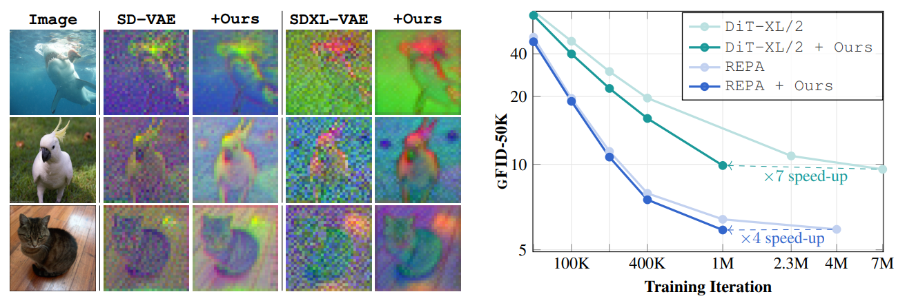

<h1 align="center">
  <span class="texttt">EQ-VAE</span>: Equivariance Regularized Latent Space for Improved Generative Image Modeling
</h1>


<div align="center">
  <a href="https://scholar.google.com/citations?user=a5vkWc8AAAAJ&hl=en" target="_blank">Theodoros&nbsp;Kouzelis</a><sup>1,3</sup> &ensp; <b>&middot;</b> &ensp;
  <a href="https://scholar.google.com/citations?user=B_dKcz4AAAAJ&hl=el" target="_blank">Ioannis&nbsp;Kakogeorgiou</a><sup>1</sup> &ensp; <b>&middot;</b> &ensp;
  <a href="https://scholar.google.fr/citations?user=7atfg7EAAAAJ&hl=en" target="_blank">Spyros&nbsp;Gidaris</a><sup>2</sup> &ensp; <b>&middot;</b> &ensp;
  <a href="https://scholar.google.com/citations?user=xCPoT4EAAAAJ&hl=en" target="_blank">Nikos&nbsp;Komodakis</a><sup>1,4,5</sup>  
  <br>
  <sup>1</sup> Archimedes/Athena RC &emsp; <sup>2</sup> valeo.ai &emsp; <sup>3</sup> National Technical University of Athens &emsp; <br>
  <sup>4</sup> University of Crete &emsp; <sup>5</sup> IACM-Forth &emsp; <br>

<p></p>
<a href="https://diff-mining.github.io/"></a>
<a href="https://arxiv.org/abs/2307.05473"></a>
<a href="https://diff-mining.github.io/ref.bib"></a>
<p></p>




</div>


<br>

<b>TL;DR</b>: We propose $\texttt{EQ-VAE}$, a simple objective that regularizes the latent space of pretrained autoencoders by enforcing equivariance under scaling and rotation transformations. The resulting latent distribution is better for generative model training, resulting in speed-up training and better performance.


### 0. HuggingFace checkpoint
If you just want to use $\texttt{EQ-VAE}$ to speedup 🚀 the training on your diffusion model you can use our [HuggingFace](https://huggingface.co/zelaki/eq-vae) checkpoint 🤗.

```python
from diffusers import AutoencoderKL
eqvae = AutoencoderKL("zelaki/eq-vae")
```


### 1. Environment setup
```bash
conda env create -f env.yaml
conda activate eqvae
```


### 2. Download SD-VAE
To download the $\texttt{SD-VAE}$ from the official LDM repository run:


```bash
bash download_sdvae.sh
```


### 3. Dataset

#### Dataset download

Currently, we provide experiments for [OpenImages](https://storage.googleapis.com/openimages/web/index.html) and  [ImageNet](https://www.kaggle.com/competitions/imagenet-object-localization-challenge/data). After downloading modify paths of train_dir, val_dir, dataset_name in the [cofig file](configs/eqvae_32x32x4.yaml)


### 4. Training

To run $\texttt{EQ-VAE}$ regularization on 8 GPUs:

```bash
python main.py \
    --base configs/eqvae_config.yaml \
    -t \
    --gpus 0,1,2,3,4,5,6,7 \
    --resume pretrained_models/model.ckpt \
    --logdir logs/eq-vae   
```


Then this script will automatically create the folder in `logs/eq-vae` to save logs and checkpoints.
The provided arguments in `configs/eqvae_config.yaml` are the ones used in our paper.  You can adjust the following options for your experiments:

- `anisotropic`: If `True` will do anisotropic scaling 
- `uniform_sample_scale`: If `True` will sample scale factors uniformly from `[0.25, 1)` if set to `False` will randomly choose from scales from `{0.25, 0.5, 0.75}`.
- `p_prior`: Probability to do prior preservation instead of equivariance regularization
- `p_prior_s`: Probability to do prior presevation on lower resolutions instead of equivariance regularization
  


### 5. Evaluation
To evaluate the reconstruction, calculate rFID, LPIPS, SSIM and PSNR on a validation set (we use Imagenet Validation in our paper) with the following:
```bash
torchrun --nproc_per_node=8 eval.py \
  --data_path /path/to/imagenet/validation/ \
  --output_path results \
  --ckpt_path /path/to/your/ckpt
```


### Acknowledgement

This code is mainly built upon [LDM](https://github.com/CompVis/latent-diffusion). 